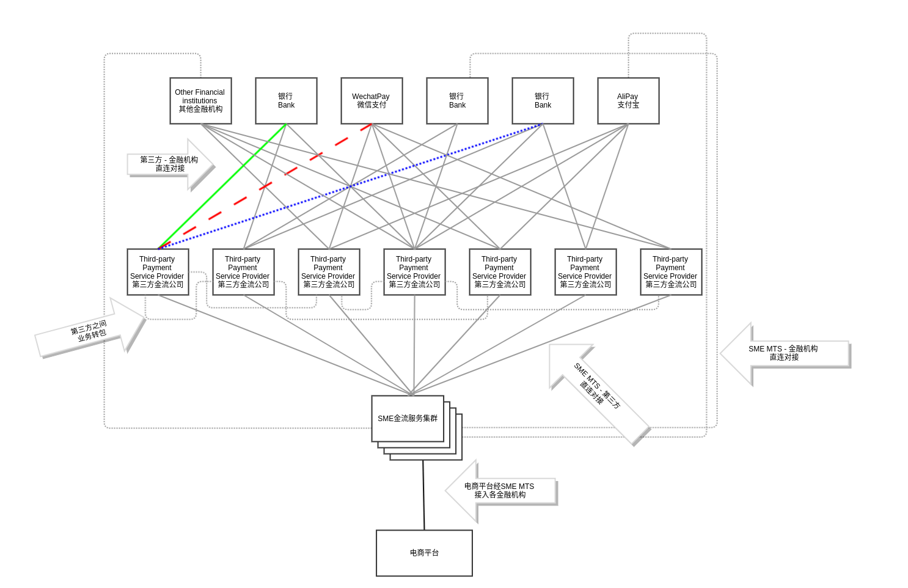

# SME-MTS(SME Money Transfer Service) - SME金流服务

## 项目简介

[金流服务][1]是一种简化商户接入电子支付平台的支付网关，通过适配接口的方式去除各类电子支付平台的API差异，为商户提供统一简化的对接API降低接入难度。商户通过金流服务可快速为用户建立多种支付方式，从而提高交易效率加快商务发展。

SME金流服务(SME-MTS)是一套基于springboot框架的微服务实现。通过API接口，商户可接入SME-MTS为客户提供多种电子支付方式。SME-MTS并不提供完整的资金结算及前端解决方案，也不提供商务性的资源，因此商户需先自行构建电商平台及准备电子支付平台的接入账户资源。

## 项目使命

该项目的目标是建立一个性能优良，安全可靠且易于对接的支付网关，使公司内其他兄弟项目可方便的接入基数庞大的金融机构支付平台，迅速开展支付业务。同时通过实时分析各个资金渠道的运行质量及资费情况智能选择出当下性价比最优的资金通道，为合作方节省金流成本。

本项目遵循dev/ops实践及微服务架构设计，期望籍此建立一套高可维护，稳定可靠且易于扩容的企业级应用。

## 前置需求

TODO

## 入门指南

### 开发环境部署

* TODO

### 生产环境部署

* TODO

## 功能特性

* TODO

## API

* TODO

## 支持人员

* Robb(robb@smeinternet.com)

<!---
* Novia(novia@smeinternet.com)
--->

[1]:https://atm60000.com/%E9%9B%BB%E5%95%86%E4%B8%AD%E8%AC%9B%E7%9A%84%E3%80%8C%E9%87%91%E6%B5%81%E3%80%8D%E6%98%AF%E4%BB%80%E9%BA%BC%EF%BC%9F%E9%87%91%E6%B5%81%E7%99%BD%E8%A9%B1%E6%96%87%E8%A7%A3%E9%87%8B%E8%88%87%E6%8E%A8/
