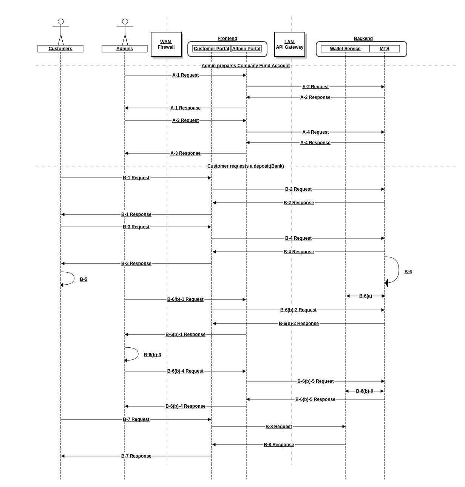

# SME-MTS 软件设计

## 业务功能流程

### 客户自主转账充值(平台银行账号收款)

管理员增加平台资金账号

* A-1: 管理员跳转至平台资金账户管理页面
* A-2: 查询平台资金账户类型列表(Rest:GET <MTS>/api/v0/metadata)
* A-3: 管理员增加平台资金账户(提交平台资金账户增加表单)
* A-4: 增加平台资金账户记录(Rest:POST <MTS>/api/v0/fund-accounts)

客户自主转账充值

* B-1: 客户跳转至充值申请页面
* B-2: 查询平台资金账户列表(Rest:GET <MTS>/api/v0/fund-accounts)
* B-3: 客户申请自主转账充值(提交自主转账充值申请表单)
* B-4: 增加收款任务(Rest:POST <MTS>/api/v0/tasks)
  * 向客户展示存款单(收款人/银行账号/转账金额/附言)
* B-5: 客户自主转账
* B-6: 自动轮询平台资金账户到账流水(Test Double)
* B-6(a): 到账记录匹配成功(匹配字段:付款人,附言,金额)
  * 自动确认收款成功
  * 通知钱包模块加币(RPC)(Rest)
* B-6(b): 到账记录匹配失败(掉单或超时)
  * B-6(b)-1: 管理员跳转至收款任务管理页面
  * B-6(b)-2: 查询收款任务列表(Rest:GET <MTS>/api/v0/tasks)(Rest:GET <MTS>/api/v0/tasks/<uuid>)
  * B-6(b)-3: 人工确认到账记录
  * B-6(b)-4: 管理员确认收款成功(提交收款任务修改表单)
  * B-6(b)-5: 更新收款任务(Rest:PUT <MTS>/api/v0/tasks)(Rest:PATCH <MTS>/api/v0/tasks/<id>)
  * B-6(b)-6: 通知钱包模块加币(RPC or Rest)
  * B-6(b)-7: 客户跳转至钱包管理页面
  * B-6(b)-8: 查询客户钱包余额(Rest)

### 客户提款(DEMO演示)

TODO

## 数据实体

TODO

## 模块调用流程

TODO
