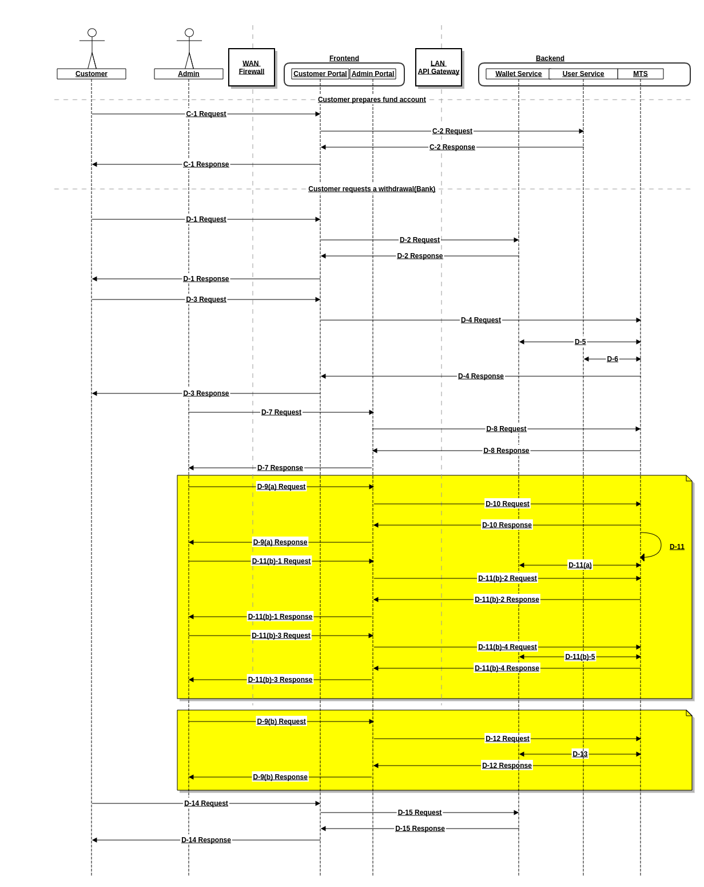

# SME-MTS 软件设计

## 业务功能流程

### [DEMO]客户自主转账充值(平台银行账号收款)

管理员增加平台资金账号

* A-1: 管理员跳转至平台资金账号管理页面
* A-2: 查询平台资金账号类型列表(Rest:GET <MTS>/api/v0/metadata)
* A-3: 管理员增加平台资金账号(提交平台资金账号增加表单)
* A-4: 增加平台资金账号记录(Rest:POST <MTS>/api/v0/fund-accounts)

客户自主转账充值

* B-1: 客户跳转至充值申请页面
* B-2: 查询平台资金账号列表(Rest:GET <MTS>/api/v0/fund-accounts)
* B-3: 客户申请自主转账充值(提交自主转账充值申请表单)
* B-4: 增加收款任务(Rest:POST <MTS>/api/v0/tasks)
  * 向客户展示存款单(收款人/银行账号/转账金额/附言)
* B-5: 客户自主转账
* B-6: 自动轮询平台资金账号到账流水(Test Double)
* B-6(a): 到账记录匹配成功(匹配字段:付款人,附言,金额)
  * 自动确认收款成功
  * 通知钱包模块加币(Wallet Service API)
* B-6(b): 到账记录匹配失败(掉单或超时)
  * B-6(b)-1: 管理员跳转至收款任务管理页面
  * B-6(b)-2: 查询收款任务列表(Rest:GET <MTS>/api/v0/tasks)(Rest:GET <MTS>/api/v0/tasks/<uuid>)
  * B-6(b)-3: 人工确认到账记录
  * B-6(b)-4: 管理员确认收款成功(提交收款任务修改表单)
  * B-6(b)-5: 更新收款任务(Rest:PUT <MTS>/api/v0/tasks)(Rest:PATCH <MTS>/api/v0/tasks/<id>)
  * B-6(b)-6: 通知钱包模块加币(Wallet Service API)
  * B-6(b)-7: 客户跳转至钱包管理页面
  * B-6(b)-8: 查询客户钱包余额(Wallet Service API)

### [DEMO]客户申请提款(转账至客户银行账号)

客户设置提款资金账号

* C-1: 客户设置提款资金账号
* C-2: 更新客户提款资金账号(User Service API)

客户申请提款

* D-1: 客户跳转至提款申请页面
* D-2: 查询客户余额(Wallet Service API)
* D-3: 客户申请提款(提交提款申请表单)
* D-4: 增加出款任务(Rest:POST <MTS>/api/v0/tasks)
  * 返回业务受理
* D-5: 冻结提款款项(Wallet Service API)
* D-6: 查询客户提款资金账号(User Service API)
* D-7: 管理员跳转至出款任务管理页面
* D-8: 查询出款任务列表(Rest:GET <MTS>/api/v0/tasks)(Rest:GET <MTS>/api/v0/tasks/<uuid>)
* D-9: 管理员审批出款任务

 

  
<strong>D-9(a): 管理员通过客户提款申请</strong>

  <ul>
   <li>D-10: 更新出款任务状态(Rest:PUT <MTS>/api/v0/tasks)(Rest:PATCH <MTS>/api/v0/tasks/<id>)</li>
   <li>D-11: 自动转账(Test Double)</li>
   <li>D-11(a): 自动转账成功
   <ul>
    <li>划扣冻结金额(Wallet Service API)</li>
   </ul></li>
   <li>D-11(b): 自动转账失败
   <ul>
    <li>D-11(b)-1: 管理员跳转至出款任务管理页面</li>
    <li>D-11(b)-2: 查询出款任务列表(Rest:GET <MTS>/api/v0/tasks)(Rest:GET <MTS>/api/v0/tasks/<uuid>)</li>
    <li>D-11(b)-3: 管理员取消出款任务</li>
    <li>D-11(b)-4: 更新出款任务状态(Rest:PUT <MTS>/api/v0/tasks)(Rest:PATCH <MTS>/api/v0/tasks/<id>)</li>
    <li>D-11(b)-5: 撤销冻结金额(Wallet Service API)</li>
   </ul></li>
   </ul>
  

  

  
<strong>D-9(b): 管理员拒绝客户提款申请</strong>

  <ul>
   <li>D-12: 更新出款任务状态(Rest:PUT <MTS>/api/v0/tasks)(Rest:PATCH <MTS>/api/v0/tasks/<id>)</li>
   <li>D-13: 撤销冻结金额(Wallet Service API)</li>
  </ul>
  

     
* D-14: 客户查询钱包余额
* D-15: 查询客户余额(Wallet Service API)

## 数据实体

TODO

## 模块调用流程

TODO
